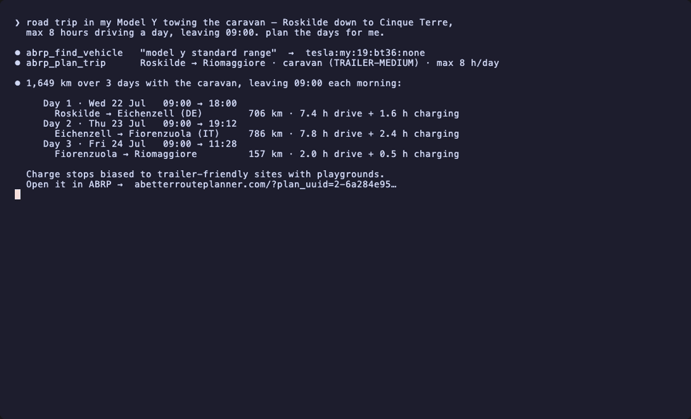

# abrp-mcp

An **unofficial** [Model Context Protocol](https://modelcontextprotocol.io) server for the
[A Better Route Planner](https://abetterrouteplanner.com) (ABRP) / [Iternio](https://www.iternio.com/api)
EV routing API. Built with [Hono](https://hono.dev) and deployable on Vercel as a single
serverless function.

It exposes ABRP's EV route planner — route + charging stops, charge curves, charger search,
vehicle models, range estimates, and live telemetry — as MCP tools, with a stateless OAuth flow
so each user supplies their own API key.

> Not affiliated with, endorsed by, or sponsored by Iternio. "A Better Route Planner" and "ABRP"
> are trademarks of Iternio AB.

> ⚠️ **Hobby experiment, no guarantees.** This is a weekend project. The `/plan` endpoint is
> billed per call by Iternio — read the code and mind your API key before connecting an LLM.



## Hosted instance

A public instance runs at **`https://abrp-mcp.vercel.app`** — MCP endpoint
**`https://abrp-mcp.vercel.app/mcp`**. It holds no API key: every user authorizes with their own
ABRP key via the built-in OAuth flow (nothing is stored server-side; your key is sealed into the
access token). Point any OAuth-capable MCP client at the `/mcp` URL, or self-host your own (see
[Deploy to Vercel](#deploy-to-vercel)).

## Tools

| Tool | What it does | Auth |
| --- | --- | --- |
| `abrp_check_access` | Validate the API key against a free endpoint | API key |
| `abrp_find_vehicle` | Search the model catalogue by name → exact `typecode` | API key |
| `abrp_plan_route` | Plan an EV route with charging stops (friendly inputs) | API key |
| `abrp_plan_trip` | Plan a long route split into dated daily legs (max-hours/day, daily start time) + overnight stops | API key |
| `abrp_plan_raw` | Plan with a full raw `PlanRequest` body | API key |
| `abrp_refresh_route` | Re-optimise an in-progress route from live position/SoC | API key |
| `abrp_search_networks` | Find charging-network ids (for network preferences) | API key |
| `abrp_list_vehicles` | List vehicles on your ABRP account + typecodes | API key + **session** |
| `abrp_get_charge_curve` | Charge curve (power vs SoC) for a model at a charger | API key |
| `abrp_get_reference_consumption` | Reference consumption (Wh/km) for a model | API key |
| `abrp_estimate_range` | Range plot — reachable points from a location | API key |
| `abrp_get_chargers` / `abrp_get_charger` | Fetch chargers by id | API key |
| `abrp_search_chargers` | Find chargers near a coordinate | API key |
| `abrp_send_telemetry` | Push live telemetry via the free v1 `/tlm/send` | API key + **user token** |

> ⚠️ **Billing:** `abrp_plan_route` / `abrp_plan_trip` / `abrp_plan_raw` call Iternio's `/plan`
> endpoint, which is **billed per successful plan**. Every other endpoint is free.

Planning tools return a `viewUrl` (`https://abetterrouteplanner.com/?plan_uuid=…`) so you can open
the result in the ABRP web app or mobile app.

**Towing & amenities.** Set the vehicle `configuration` (e.g. `TRAILER-SMALL/MEDIUM/LARGE`) to model
a caravan's extra consumption, and bias stops toward amenities with
`charging.preferredFeatures` — `TRAILER_FRIENDLY` (pull-through), `HAS_PLAYGROUND`,
`HAS_OPEN_RESTROOMS`, `DOG_FRIENDLY`, `PLUG_AND_CHARGE` — or free-text `charging.preferredTags`.

**Conditions & preferences.** Plans also accept `weather` (`SEASONAL` / `REAL_TIME` / `MANUAL` with
°C, wind, road conditions — strongly affects range), `traffic` (`REAL_TIME`, premium),
`currency` + `units` for the output, `alternatives: true` to get the 2–3 alternative routes, and
`charging.networks` to prefer/exclude specific networks (look up ids with `abrp_search_networks`).

## Getting an API key

You need an Iternio Planning API key (the `X-API-KEY`). There are two ways to get one.

### 1. The proper way — ask Iternio (recommended)

Email **`contact@iternio.com`** and request a developer/test key. There's a small one-time setup
cost and then per-plan billing on the `/plan` endpoint; **every other endpoint is free**. This is
the only path that's officially sanctioned, gives you your own quota, and won't disappear out from
under you. If you're going to use this for anything beyond a quick experiment, do this.

### 2. The quick, unofficial way — at your own risk

> ⚠️ **Unofficial. Use at your own risk.** The ABRP web app ships a **shared** API key in its
> front-end (the same key for every visitor). You can read it from your browser's network tab. It
> works — but it is **not yours**: plans you make are billed to Iternio's own account, the key can
> be rate-limited or rotated at any moment without notice, and relying on it for anything public or
> long-lived is not OK. Treat it as a way to *try the project in five minutes*, not to run a service.
> If you find it useful, get your own key (option 1) and support them.

1. Log in at <https://abetterrouteplanner.com> with a (free) account.
2. Open DevTools → **Network**, plan any route, and look at the request to `api.iternio.com`.
3. Copy the **`x-api-key`** request header. (That's the only thing the public `/plan` endpoint
   needs — a typecode plan works without your session.)
4. Use it as `ABRP_API_KEY` / the `X-API-KEY` header. **Never commit it** to a repo.

> The optional `x-abrp-session` JWT in that same request is *your* short-lived account session
> (~15 min). It's only needed for user-scoped calls (listing the cars saved on your account); plain
> typecode planning doesn't need it.

## Credentials

ABRP uses up to four credentials (v2 API unless noted):

- **`X-API-KEY`** — the Planning API key. **Required.** See [Getting an API key](#getting-an-api-key) above.
- **`X-ABRP-SESSION`** — a user session, only needed for user-scoped calls like listing your vehicles.
- **user token** — for the free **v1** `/tlm/send` telemetry endpoint. Generate it in the ABRP app
  under **Settings → Live Data**.
- **`X-TLM-TOKEN`** — telemetry token for v2 telemetry (optional).

You provide them one of three ways (in precedence order):

1. **OAuth** — connect via the built-in login page and paste your credentials; they're sealed
   (AES-256-GCM) inside the issued Bearer token. Nothing is stored server-side.
2. **Headers** — `X-API-KEY` (or `X-ABRP-API-Key`), `X-ABRP-Session`, `X-ABRP-Token` (v1 user
   token), `X-TLM-Token`. Header values override the corresponding OAuth/env value per request.
3. **Env vars** — `ABRP_API_KEY`, `ABRP_SESSION`, `ABRP_USER_TOKEN`, `ABRP_TLM_TOKEN`
   (single-tenant / local dev).

## Local development

```bash
pnpm install
cp .env.example .env        # set OAUTH_SECRET; optionally ABRP_API_KEY for a single-tenant run
pnpm dev                    # http://localhost:3000  (MCP at /mcp)
```

### Serving HTTPS locally (for Claude Desktop)

Claude Desktop's connector UI requires an `https://` URL. Since the app runs on your own
machine, you don't need a tunnel — just serve HTTPS locally with a **trusted** cert from
[mkcert](https://github.com/FiloSottile/mkcert) (it installs a local CA, so there are no
certificate warnings):

```bash
brew install mkcert            # once
mkcert -install                # trust the local CA (once)
mkdir -p certs
mkcert -cert-file certs/localhost.pem -key-file certs/localhost-key.pem localhost 127.0.0.1 ::1
pnpm dev                       # now auto-detects certs/ and serves https://localhost:3000
```

`pnpm dev` serves HTTPS automatically when `certs/localhost.pem` + `certs/localhost-key.pem`
exist (override paths with `TLS_CERT` / `TLS_KEY`), and falls back to HTTP otherwise. The
`certs/` directory is gitignored — never commit keys.

Quick check:

```bash
curl -s localhost:3000/ | jq
curl -s -X POST localhost:3000/mcp \
  -H 'Content-Type: application/json' \
  -H 'Accept: application/json, text/event-stream' \
  -d '{"jsonrpc":"2.0","id":1,"method":"tools/list"}'
```

## Deploy to Vercel

The app is a single Node function (`api/index.ts`) with all routes rewritten to it
(`vercel.json`). Deploy, then set env vars:

```bash
vercel
vercel env add OAUTH_SECRET production    # openssl rand -base64 48
# optional single-tenant fallback:
vercel env add ABRP_API_KEY production
```

For multi-tenant use, leave `ABRP_API_KEY` unset — every user authorizes with their own key via OAuth.

## Connecting a client

Point any MCP client at `https://<your-deployment>/mcp`. Clients that support OAuth will discover
the authorization server automatically (RFC 8414 / 9728 metadata + RFC 7591 dynamic registration)
and open the login page. Clients that don't can send an `X-API-KEY` header instead.

### Claude Desktop (local)

Run the server locally over HTTPS (see [above](#serving-https-locally-for-claude-desktop)) with
`ABRP_API_KEY` set in `.env`, then add it to
`~/Library/Application Support/Claude/claude_desktop_config.json` via the
[`mcp-remote`](https://www.npmjs.com/package/mcp-remote) bridge and restart Claude Desktop:

```json
{
  "mcpServers": {
    "abrp": {
      "command": "npx",
      "args": ["-y", "mcp-remote", "https://localhost:3000/mcp"],
      "env": {
        "NODE_EXTRA_CA_CERTS": "/Users/<you>/Library/Application Support/mkcert/rootCA.pem"
      }
    }
  }
}
```

`NODE_EXTRA_CA_CERTS` points Node at the mkcert CA so `mcp-remote` trusts the local cert (find
the path with `mkcert -CAROOT`). With `ABRP_API_KEY` in `.env`, no OAuth login is needed — the
tools are available as soon as Claude Desktop restarts.

To use the **hosted instance** instead of running locally, drop the cert/env entirely and point
at it — `mcp-remote` will open the OAuth login page for your key:

```json
{
  "mcpServers": {
    "abrp": { "command": "npx", "args": ["-y", "mcp-remote", "https://abrp-mcp.vercel.app/mcp"] }
  }
}
```

Prefer to skip the login page? Pass your key as a header and `mcp-remote` authenticates directly:

```json
{
  "mcpServers": {
    "abrp": {
      "command": "npx",
      "args": ["-y", "mcp-remote", "https://abrp-mcp.vercel.app/mcp", "--header", "X-API-KEY: YOUR_KEY"]
    }
  }
}
```

### Claude Code

Claude Code speaks HTTP MCP natively — no `mcp-remote` needed. Add the hosted instance with your
key as a header:

```bash
claude mcp add --transport http --scope user abrp \
  https://abrp-mcp.vercel.app/mcp --header "X-API-KEY: YOUR_KEY"
```

Or omit `--header` to authorize via OAuth (`/mcp` in the TUI to log in). Point at your own
`http://localhost:3000/mcp` instead of the hosted URL to use a local server. Run `claude mcp list`
to confirm it shows `✔ Connected`, then restart Claude Code so the `abrp` tools load.

Example route plan (tool `abrp_plan_route`):

```json
{
  "destinations": [
    { "lat": 55.7122, "long": 13.2159, "name": "Lund" },
    { "address": "Stockholm, Sweden", "minArrivalSocFrac": 0.15 }
  ],
  "typecode": "rivian:r1s:21:135",
  "currentSocFrac": 0.8,
  "charging": { "connectorTypes": ["CCS", "NACS"], "stopPreference": "FEWER" }
}
```

## How it works

- **`src/abrp.ts`** — typed client over the v2 REST API (`https://api.iternio.com/2`) and the v1
  telemetry endpoint (`https://api.iternio.com/1`).
- **`src/tools.ts`** — MCP tool definitions (Zod schemas) wrapping the client.
- **`src/server.ts`** — Hono app: discovery metadata, OAuth (authorize/token/register), and the
  `/mcp` Streamable HTTP transport.
- **`src/oauth.ts`** — stateless OAuth 2.1: every code/token/client-id is an AES-256-GCM sealed
  blob, so no database is needed. Your ABRP credentials are sealed inside the access token.
- **`src/login-page.ts`** — the credential entry form.

## Contributing

Ideas, bug reports and PRs are very welcome — this is a hobby project and easy to hack on. See
[CONTRIBUTING.md](./CONTRIBUTING.md) for the short version. The gist:

```bash
pnpm install
pnpm dev          # local server (http://localhost:3000, or https with mkcert certs)
pnpm typecheck    # tsc --noEmit
```

Adding a tool is usually a few lines: wrap the endpoint in `src/abrp.ts`, then register the tool
with its Zod schema in `src/tools.ts`. Open an issue first for anything large so we can talk it
through. Found a security issue? Please report it privately — see [SECURITY.md](./SECURITY.md).

## References

- Iternio Planning API v2 (Swagger): https://api.iternio.com/swagger-ui/
- OpenAPI spec: https://api.iternio.com/swagger-ui/spec/prod/IternioPlanning.out.yaml
- API overview: https://www.iternio.com/api
- v1 telemetry (Postman): https://documenter.getpostman.com/view/7396339/SWTK5a8w

## License

MIT — see [LICENSE](./LICENSE). Unofficial; not affiliated with Iternio.
